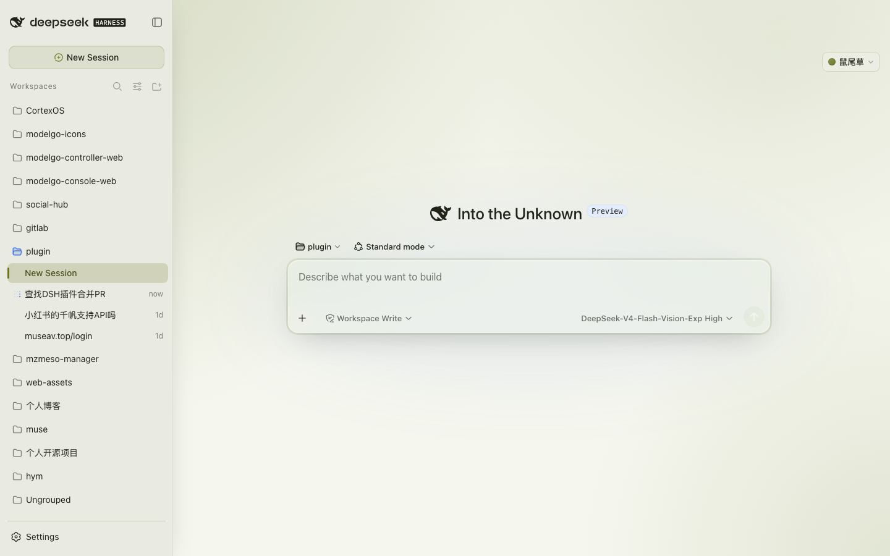
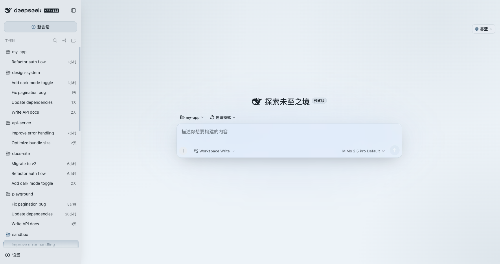
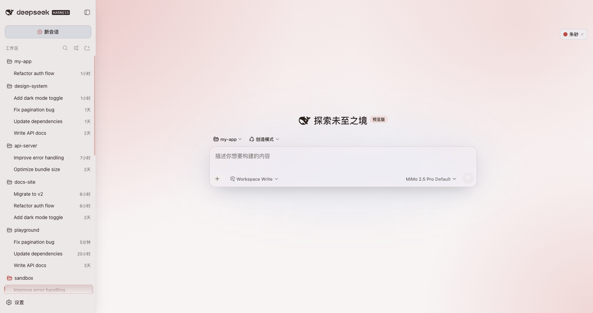
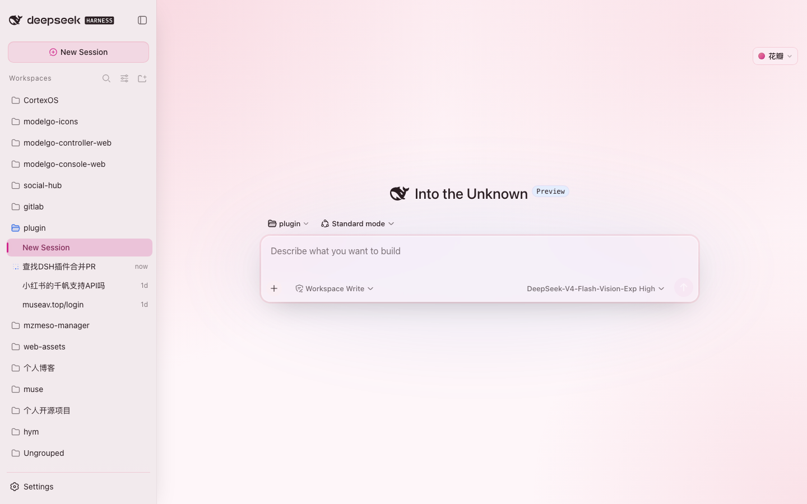
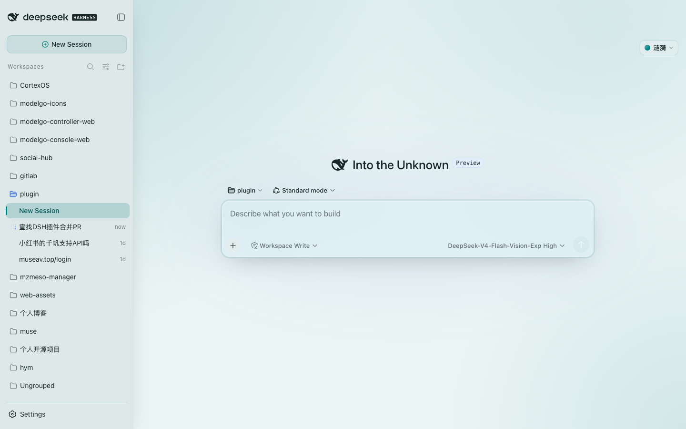
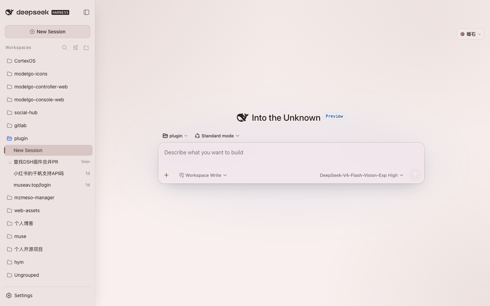
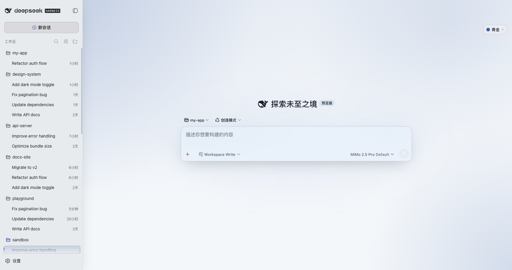
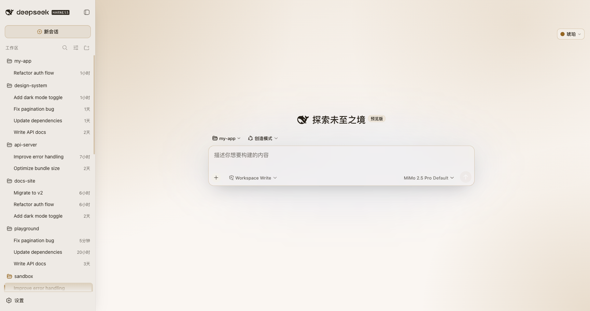
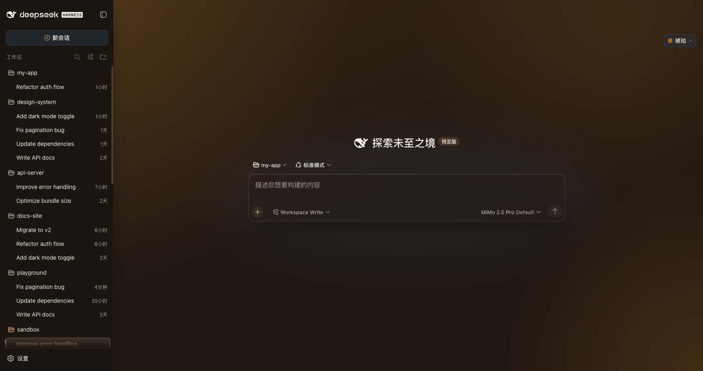

<p align="center">
  
</p>

<!-- bloom-series-nav -->

<table align="center">
<tr>
<td align="center" width="33%"><a href="https://github.com/webkubor/typora-Bloom-theme">🌸 Bloom for Typora</a><br/><sub>24 themes</sub></td>
<td align="center" width="33%"><b>🌊 Bloom for DSH</b><br/><sub>8 palettes · current</sub></td>
<td align="center" width="33%"><a href="https://github.com/webkubor/contrast-guard">🛡️ contrast-guard</a><br/><sub>color guardrail</sub></td>
</tr>
</table>

<p align="center">
  <sub>One Morandi design language — two themes, and the tool that keeps their colors honest.<br/>
  <i>同一套莫兰迪设计语言：两个宿主的主题，加一个守住它们配色的工具。</i></sub>
</p>

<p align="center">
  <a href="https://www.npmjs.com/package/@kubor/dsh-bloom-theme"></a>
  <a href="https://www.npmjs.com/package/@kubor/dsh-bloom-theme"></a>
  
  
</p>

<p align="center">
  <a href="https://awesome-dsh-plugin.com"></a>
  <a href="https://github.com/deepseek-ai/deepseek-harness"></a>
  <a href="https://github.com/topics/dsh-plugin"></a>
  
  
  
  
</p>

<p align="center">
  <a href="README.md">中文</a> | <b>English</b>
</p>

<p align="center">
  Bringing the Morandi feel of <a href="https://github.com/webkubor/typora-Bloom-theme">Bloom</a> (a 90★ Typora theme)
  to <a href="https://github.com/deepseek-ai/deepseek-harness">DeepSeek Harness</a>.
  <br />
  <b>Glass + Morandi</b>: 8 light/dark palettes, frosted-glass panels, one-click switching from the top bar —
  even the waiting state breathes with the theme.
</p>

## The gist

A **glass + Morandi** theme for DeepSeek Harness.
Eight light/dark palettes, adaptive by light/dark; panels are real frosted glass
(semi-transparent + backdrop blur + glass edges); colors are low-saturation Morandi
(OKLCH, WCAG AA); restrained, consistent micro-interactions; zero runtime deps; TypeScript front-end.

> The Morandi character does not live in `--accent`. It lives in `--accent-rgb`.

## Screenshots

<p align="center">
  
  <sub>Sage · light — frosted-glass panels + the selected session row tints with the active theme</sub>
</p>

**8 palettes (light)**: click any one and the whole accent / background / glass / motion hue switches together.

<table align="center">
<tr>
<td align="center">☁️ Mist<br/></td>
<td align="center">🧧 Cinnabar<br/></td>
<td align="center">🌸 Petal<br/></td>
<td align="center">🌊 Ripple<br/></td>
</tr>
<tr>
<td align="center">🌿 Sage<br/></td>
<td align="center">🧱 Stone<br/></td>
<td align="center">🔷 Lapis<br/></td>
<td align="center">🍯 Amber<br/></td>
</tr>
</table>

**Every palette has a dark variant too** (example: Amber · dark):

<p align="center">
  
</p>

## Install

```bash
# via the dsh CLI (recommended)
dsh plugin add @kubor/dsh-bloom-theme

# or global install + enable
npm i -g @kubor/dsh-bloom-theme
dsh plugin enable @kubor/dsh-bloom-theme
```

Refresh the page and a "Mist ▾" theme button appears top-right. Click it to switch between
**8 palettes**; the current version sits at the bottom of the dropdown, and a `↑ vX` badge
lights up when a newer version is on npm (jump to the Releases page).

## Features

| Feature | Description |
| :-- | :-- |
| **Frosted-glass panels (on by default)** | Semi-transparent fill + `backdrop-filter` blur + glass edges (top highlight / translucent stroke / soft outer glow), adaptive opacity per light/dark |
| **8 Morandi palettes** | Mist / Cinnabar / Petal / Ripple / Sage / Stone / Lapis / Amber, each with light & dark, one-click switch |
| **Two-track colors** | A readable track for contrast (text/buttons) and a mood track for ambient gradients — never mixed |
| **Micro-interactions** | Menu entrance, selected-row bar slide-in, hover / press feedback; shared duration & easing tokens, consistent everywhere |
| **Theme-colored thinking animation** | `Deep diving…` flows through the current theme's three-color spectrum; auto-still under `prefers-reduced-motion` |
| **Version / update hints** | Current version at the bottom of the dropdown; `↑ vX` chip when npm is newer; update banner for very stale installs |
| **OKLCH + WCAG AA** | Perceptually uniform color space, no jumps on light/dark switch; all accent/background pairs measured ≥ 4.5:1 |
| **Zero deps · CSS-variable driven** | Only CSS variables + a little switch logic; near-zero runtime cost |
| **Respects native controls** | Switcher mounts into the DSH header utilities area, side-by-side with native buttons |
| **TypeScript build** | `src/` 10 modules → `tsc` (ESM) for node + `esbuild` (single-file IIFE) for browser; one-command `build / deploy / check / preflight` |

## Design: two-track colors

Bloom's point was never "swap the colors" — it is a complete **Morandi design language**:
low-saturation ambient gradients, cool-toned hairlines, long soft shadows, restrained radii and spacing.

The easiest thing to get wrong (and most often done wrong) is the **two-track color**:

- **Readable track `--bloom-accent`** — deliberately deepened to pass WCAG; for text / buttons / selected states;
- **Mood track `--accent-rgb`** — the real Morandi color (low-saturation, grayed); used only for large ambient gradients and cool hairlines.

All 14 gradient usages in the original use the mood track, never the readable track. When you paint a
large area with the readable color, Petal goes from lotus pink to fluorescent magenta and the Morandi feel dies.
This plugin ports both tracks intact, and the sibling tool [contrast-guard](https://github.com/webkubor/contrast-guard)
keeps accent/background contrast honest.

## Develop / build (TypeScript)

```bash
npm install
npm run typecheck    # tsc --noEmit, full type check
npm run build        # typecheck → tsc emits lib/index.js → esbuild emits lib/client.js
npm run deploy       # one-click deploy to local DSH (sync-version → build → rsync)
npm run preview      # deploy + open http://127.0.0.1:3080
npm run dev          # build + watch (recompile+deploy on src change)
npm run package      # one-click package (npm pack → .tgz)
npm run check        # 6 static gates + contrast-guard (runs on every commit)
npm run preflight    # pre-release: version consistency / git state / listing sync
```

`src/` is 10 modules (`meta` · `palette` · `tokens` · `css/` · `dom` · `version` ·
`switcher` · `client`); DSH loads the artifacts in `lib/`.

**The build is dual-track** — the two halves want opposite module formats:

| Artifact | Compiler | Format | Why |
|---|---|---|---|
| `lib/index.js` (node side) | `tsc` | **ESM** | cordis' plugin loader reads it as ESM |
| `lib/client.js` (browser side) | `esbuild` | **single-file IIFE** | DSH runs plugin client.js as a *classic script* — a top-level `import`/`export` is a syntax error |

So the browser-side source can be split freely, but the artifact must bundle back
into one self-contained file.

The version number is bumped by release-please inside the release PR, alongside
`package.json` (via the `x-release-please-version` marker at the end of the line in
`src/meta.ts`). `scripts/sync-version.mjs` is only a local-dev fallback and is not
part of the publish path. See [CONTRIBUTING](./CONTRIBUTING.md).

## FAQ

**Theme not applying?** Hard-refresh once (`Cmd/Ctrl + Shift + R`). If the page says `Failed to load plugins`,
the client failed to register — re-run `dsh plugin add` or upgrade to the latest version.

**Can I customize colors?** For now you pick a whole palette via variants; per-color customization is on the roadmap.

## Contribute / open source

- Add a new palette: add one entry to `PALETTE` / `VARIANTS` / `VARIANT_LABELS` in `src/client.ts`
  — glass, motion, selected state and the contrast guardrail all follow automatically.
- Run `npm run build && npm run check` and make sure `contrast-guard` passes before opening a PR.
- Issues, PRs and ideas are all welcome.

## Support

If Bloom makes your DSH nicer to use, drop a ⭐ or buy me a coffee (sponsor link below and one entry in the panel menu).

## License

[MIT](LICENSE) — keep the copyright notice on borrow/modify. Palette inspiration from [typora-Bloom-theme](https://github.com/webkubor/typora-Bloom-theme).
